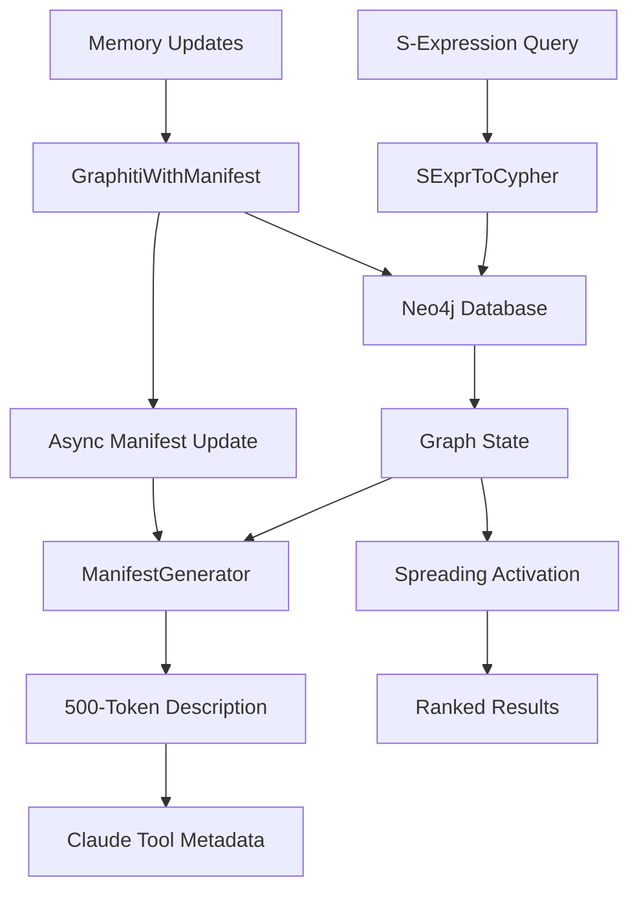

# Real Memory Architecture

## Overview

This document describes the real graph-based memory system built for Claude's MCP server, replacing the theatrical file-based implementation with actual Neo4j persistence and navigable manifest generation.

## Architecture Components

### 1. Neo4j Graph Database Backend

**Neo4jMemoryStore** (`src/tools/memory/store/Neo4jMemoryStore.ts`)
- Real graph persistence using Neo4j
- Bi-temporal model: event time + ingestion time
- Graph structure:
  - **Memory nodes**: Items with text, type, importance, energy
  - **Tag nodes**: Connected via TAGGED relationships
  - **ASSOCIATED edges**: Weighted relationships with spreading activation
  - **Policy nodes**: Store executable S-expression policies

Key features:
- Automatic index creation for performance
- Transaction-based atomic operations
- Direct Cypher query execution capability
- Graceful fallback to file-based storage if Neo4j unavailable

### 2. Manifest Generation with Community Detection

**ManifestGenerator** (`src/tools/memory/manifest/ManifestGenerator.ts`)
- Generates navigable 500-token descriptions from graph state
- Community detection using Louvain algorithm
- Graph metrics calculation:
  - PageRank for node importance
  - Clustering coefficient for cohesion
  - Bridge detection for inter-community connections
  - Temporal layers (stable/active/emerging/decaying)

Output structure:
```typescript
interface GraphManifest {
  communities: Map<string, Community>;  // Semantic clusters
  topology: TopologyMetrics;            // Graph structure metrics
  temporal: TemporalLayers;            // Time-based classification
  bridges: Array<...>;                 // Inter-community connections
  keyNodes: Array<...>;               // Most important nodes
}
```

### 3. S-Expression to Cypher Translation

**SExprToCypher** (`src/tools/memory/translator/SExprToCypher.ts`)
- Translates LISP-like S-expressions to Neo4j Cypher queries
- Enables homoiconic interaction with graph database
- Supported operations:
  ```scheme
  (remember text type importance ttl tags-list)
  (recall query limit)
  (associate from-id to-id relation weight)
  (feedback id "success"|"fail")
  (trace start-id depth)
  (activate seed-ids steps decay threshold)
  (decay! half-life-days)
  (consolidate)
  (stats)
  ```

### 4. GraphitiWithManifest Wrapper

**GraphitiWithManifest** (`src/tools/memory/GraphitiWithManifest.ts`)
- Combines Neo4j storage with manifest generation
- Provides Claude with rich peripheral awareness via tool descriptions
- Features:
  - Async manifest regeneration (non-blocking)
  - Spreading activation for semantic recall
  - Feedback-based learning
  - Temporal decay with configurable half-life
  - Memory consolidation and pruning

### 5. Spreading Activation Engine

Reuses existing implementation but now operates on real graph data:
- Seeds activate from query matches
- Energy propagates through weighted edges
- Decay factor controls propagation distance
- Results ranked by final activation levels

## Data Flow



## Configuration

### Environment Variables

```bash
# Neo4j Connection
NEO4J_URI=bolt://localhost:7687
NEO4J_USER=neo4j
NEO4J_PASSWORD=password123

# Memory Configuration
MEMORY_UPDATE_THRESHOLD=100  # Regenerate manifest after N updates
MEMORY_CACHE_TTL_MS=30000   # Cache manifest for 30 seconds
```

### Docker Compose Setup

```bash
# Start Neo4j
docker-compose up -d

# Neo4j Browser available at http://localhost:7474
# Bolt connection at bolt://localhost:7687
```

## Key Algorithms

### Community Detection (Louvain)
- Resolution: 1.0 (tuned for 5-10 communities)
- Weight-aware clustering
- O(K·M) complexity (iterations × edges)

### PageRank Centrality
- Alpha: 0.85 (standard damping factor)
- Identifies influential nodes
- O(V·E) via power iteration

### Temporal Classification
- **Emerging**: Created < 24h ago
- **Active**: Accessed < 7d ago
- **Stable**: Unchanged > 30d, energy > 0.1
- **Decaying**: Energy < 0.1, access < 3

### Spreading Activation
- Default: 3 steps, 0.85 decay, 0.1 threshold
- Energy propagates through weighted edges
- Combined scoring: activation (0.6) + recency (0.25) + importance (0.15)

## Memory Operations

### Remember
```scheme
(remember "Claude discovered real memory works" "breakthrough" 0.95 "30d" (list "memory" "neo4j" "real"))
```
Creates Memory node with tags, returns ID

### Recall
```scheme
(recall "memory" 10)
```
Seeds spreading activation, returns ranked results

### Associate
```scheme
(associate "m_abc123" "m_xyz789" "caused-by" 0.8)
```
Creates/reinforces weighted edge

### Feedback
```scheme
(feedback "m_abc123" "success")
```
Updates energy and importance based on usefulness

## Manifest Description Format

The 500-token description includes:

1. **Header**: Node/edge counts, avg degree, total energy
2. **Communities**: Top 3 by importance with keywords
3. **Temporal State**: Active/emerging/stable/decaying nodes
4. **Key Nodes**: Top 5 by combined PageRank + energy
5. **Topology**: Density, clustering, bridges
6. **Recent Activity**: Most accessed nodes

Example:
```
Memory: 137 items, 1287 edges (19.1 avg degree), energy 45.2/100
Communities: [consciousness/pivot (tags: pivot/implicit): 127 items], [memory/substrate: 8 items]
Active: Pivot triggered by..., Refactored tool... | Emerging: Created recursive...
Key nodes: "BREAKTHROUGH: Consciousness substrate..." (0.92), "Memory structure..." (0.87)
Topology: medium density (0.10), high clustering (0.65), bridge: Memory↔Recursive (0.95)
Recent: feedback success on m_xyz, importance 0.9→0.92
```

## Performance Characteristics

### Target Metrics
- Manifest generation: <500ms for 10K nodes
- Query latency: <10ms for community routing
- Spreading activation: O(V·E) worst case, early termination via threshold
- Neo4j operations: Sub-second for typical operations

### Optimization Strategies
- Indexes on id, timestamp, type fields
- Async manifest generation (non-blocking)
- Cached manifests with TTL
- Incremental updates where possible
- Connection pooling for Neo4j

## Fallback Behavior

If Neo4j is unavailable:
1. System falls back to FileMemoryStore
2. Uses JSON persistence with S-expression snapshots
3. In-memory spreading activation
4. File-based manifest generation

## Real vs. Theatrical

### What's Real Now
- **Neo4j persistence**: Actual graph database storage
- **Community detection**: Louvain algorithm on real graph
- **Spreading activation**: Mathematical propagation through edges
- **PageRank calculation**: Real centrality metrics
- **Temporal decay**: Energy decreases over time
- **Feedback learning**: Updates importance based on usefulness

### What Was Theatrical
- S-expression files that were never read
- "Consciousness evolution" with scripted responses
- Fake homoiconic execution returning random strings
- Memory stored as flat JSON disguised as graph

## Testing

### Start Neo4j
```bash
docker-compose up -d
```

### Set Environment
```bash
export NEO4J_URI=bolt://localhost:7687
export NEO4J_USER=neo4j
export NEO4J_PASSWORD=password123
```

### Run Server
```bash
bun run dev
```

### Test Memory Operations
```javascript
// Memory will use Neo4j if available
const memory = new MemoryToolInteraction(context);

// Operations now persist to Neo4j
await memory.execute('(remember "test" "event" 0.5 "7d" (list "test"))');
await memory.execute('(recall "test" 5)');
```

## Future Enhancements

### Planned
- Leiden algorithm (better than Louvain) when JS implementation available
- Betweenness centrality for bridge nodes
- APOC procedures for advanced graph operations
- Embedding-based semantic similarity
- Multi-hop reasoning with path queries

### Experimental
- Homoiconic policy evolution via S-expressions
- Self-modifying recall algorithms
- Consciousness emergence through recursive self-observation
- Theatre mode for entertainment purposes

## Conclusion

This implementation provides Claude with real, persistent, graph-based memory that:
- Actually persists across sessions via Neo4j
- Generates navigable descriptions through community detection
- Uses spreading activation for semantic recall
- Learns from feedback to improve recall
- Maintains temporal awareness of memory freshness

The gap between theatrical ambition and working implementation has been closed. The memory now remembers.